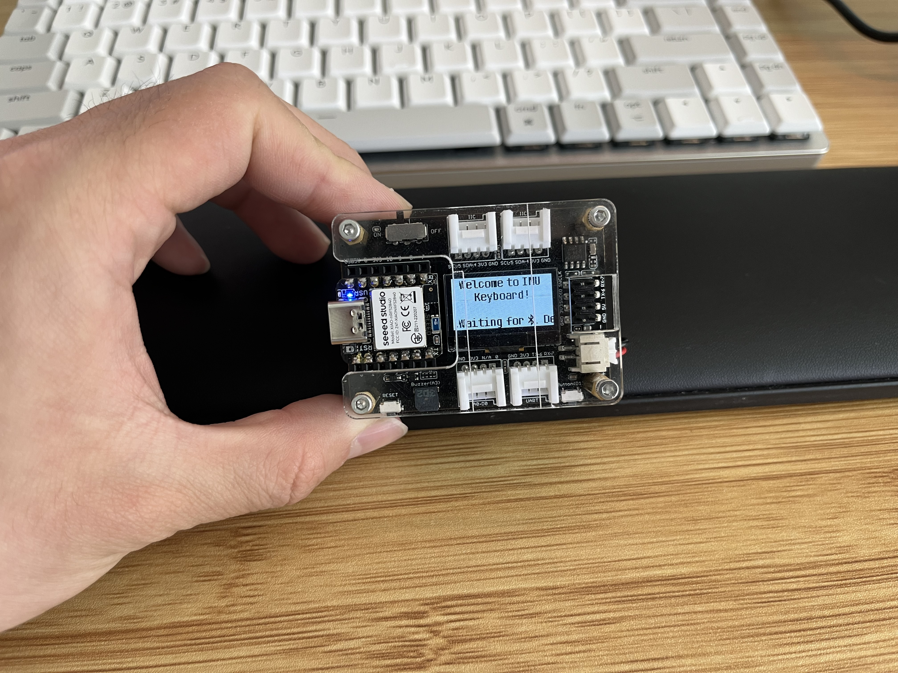
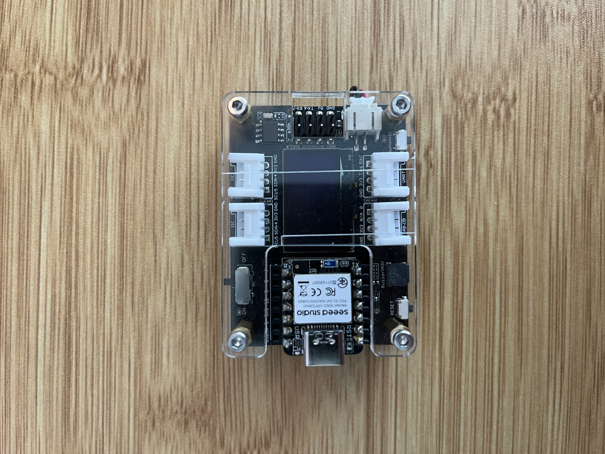
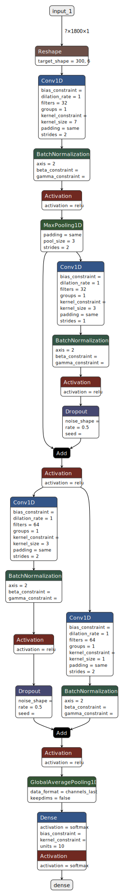

# IMU MNIST

Deep Learning Based In-Air Hand-Written Digit Recognition Using a Single IMU

A photo of the finished product.

# Introduction

In this project, I built a small device that is capable of recognizing handwritten digits (0~9) in the air using a neural network. This is similar to the famous MNIST task, which is image-based handwritten digits. Instead of using 2D image pixels, this task uses an Inertial Measurement Unit (IMU) to recognize hand-written digits. In this project, a 6-axis IMU is used to measure the movement of the hand. Although existing literature has explored the possibility of handwriting recognition using this data type, most offload the calculation to a powerful desktop computer to recognize what digit is written. I propose a different approach that makes the inference right on the microcontroller unit (MCU). The final product is a self-contained unit that is able to recognize hand-written digits and acts as a Bluetooth keyboard.

# Implementation

## Physical Build

Here are all the components of my project. The top is the Seeed Xiao Sense MCU. It has an onboard 6-axis IMU. The expansion board provides an OLED display connected through IIC. I designed the 3D-printed case for holding the battery. 

## Software System

The whole software stack is built on ZephyrRTOS. Here are the used libraries:

- RTOS and Drivers (IMU, Display-SSD1306, Buttons, LEDs, UART, BLE): [Zephyr](https://www.zephyrproject.org/)
- GUI Library: [LVGL](https://lvgl.io/)
- NN Deployment: [Edge Impulse SDK](https://edgeimpulse.com/)
- BLE connection: I adopted part of the code to emulate a keyboard from [ZMK](https://zmk.dev/).
- Keyboard Emulation: A few functions were adopted from this [repo](https://github.com/T-vK/ESP32-BLE-Keyboard/tree/master).

## Neural Network Design

The input of the neural network is a 3-second period of 6-axis IMU data sampled at 100hz. Thus, the input is of dimension 1800. The output of the network is the probability of the 10 class of digits. The network I designed is inspired from ResNet with 2D convolutions changed into 1D convolutions. The model is small for efficiency and also because I am trianing on a small self collected dataset (only about 1600 total samples):

The network is trained using Edge Impulse. It is open-sourced with Apache 2.0 License:

[imu_mnist3](https://studio.edgeimpulse.com/public/386984/live)